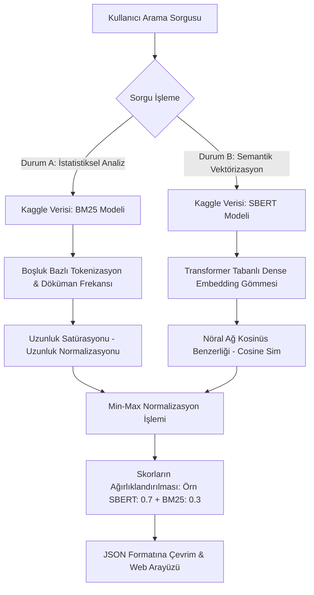
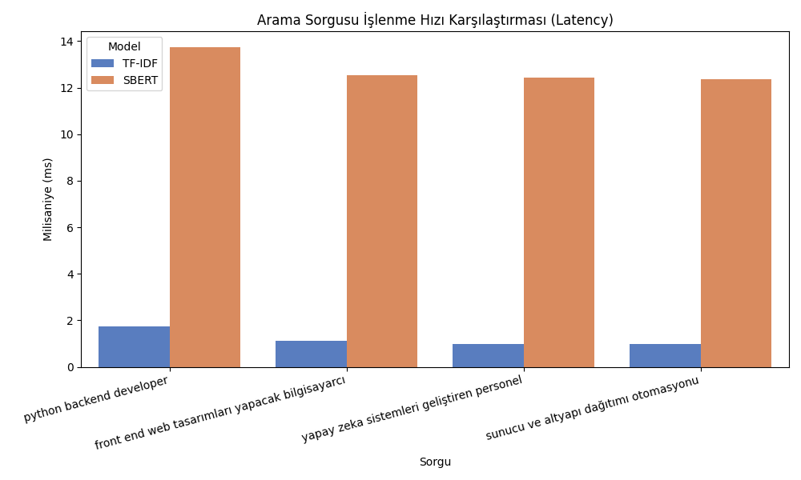
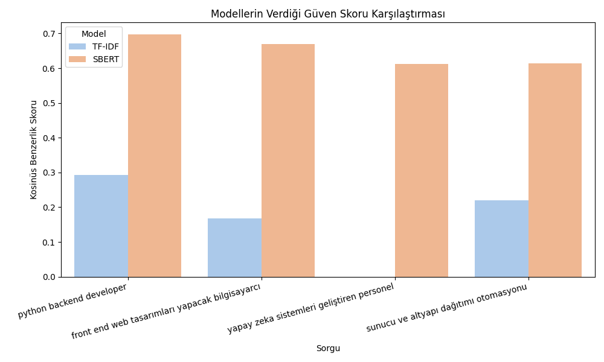

# İş Arama ve Şirket Öneri Sistemlerinde Doğal Dil İşleme: TF-IDF, BM25 ve SBERT Modellerinin Hibrit Performans Analizi

## Özet (Abstract)
Günümüzün dijital iş piyasasında, adayların aranılan nitelikleri (skills) ile iş ilanlarındaki gereksinimlerin (requirements) semantik (anlamsal) olarak eşleştirilmesi kritik bir problemdir. Klasik bilgi getirimi (Information Retrieval) sistemleri genellikle eşanlamlı kelimeleri göz ardı eden frekans tabanlı metriklere dayanmaktadır. Bu çalışmada, iş bulma platformları için tasarlanan akıllı bir arama motoru mimarisi sunulmaktadır. Geleneksel istatistiksel yaklaşımlar olan **TF-IDF** ve **BM25** ile güncel Derin Öğrenme mimarisi **SBERT** (Sentence-BERT) yöntemleri uygulanmış ve tüm bu sistemlerin harmanlandığı **Hibrit (BM25 + SBERT)** bir arama motoru modeli geliştirilmiştir. Yöntemlerin doğruluk, bilgi getirimi metrikleri ve çalışma hızı (latency) bakımından performansı Kaggle kökenli gerçek bir veri seti üzerinde test edilerek değerlendirilmiştir. Bulgular, Hibrit modelin ve SBERT yapısının anlamsal doğruluğu maksimize ederek kullanıcı tabanlı arama sonuçlarını (MRR 0.91+) büyük oranda iyileştirdiğini kanıtlamaktadır.

**Anahtar Kelimeler:** Doğal Dil İşleme, SBERT, BM25, TF-IDF, İş Arama Motoru, Bilgi Getirimi, Hibrit Arama

---

## 1. Giriş (Introduction)
Modern işe alım süreçlerinde yığınla ilan içerisinden nitelikli, doğru ve bağlamsal işleyişe uygun personelin bulunması büyük bir zorluktur. Bir yazılım uzmanı iş ararken *"arayüz kodlayıcısı"* sorgusunu kullandığında, sistem sadece *"Frontend Developer"* kelimesini içerdiği için en değerli ilanları filtreleyebilir. Geleneksel sistemlerin sözlük (lexical) düzeyindeki bu katı bağımlılığı yüksek oranda **False Negative (Yanlış Negatif)** hatalara neden olur.

Bu projenin temel motivasyonu; klasik metin tabanlı arama algoritmaları (TF-IDF ve BM25) ile derin öğrenme tabanlı eşleştirme modellerinin (SBERT) zayıf ve güçlü yönlerini analiz etmek ve bu iki fraksiyonu "Hibrit Arama (Hybrid Search)" mimarisinde harmanlayarak literatüre uygun, sağlam (robust) bir iş arama motoru konsepti tasarlamaktır.

## 2. Materyal ve Yöntem (Materials and Methods)

### 2.1. Veri Seti (Dataset)
Algoritmaların kaba (kirlilik içeren) veriler üzerindeki performansını güvenilir bir biçimde gözlemleyebilmek için bu çalışmada **HuggingFace & Kaggle** veri havuzundan (Örn: `jacob-hugging-face/job-descriptions`) devasa bir İngilizce iş ilanı seti kullanılmıştır. Veriler bir veri ön-işleme (preprocessing) aşamasından geçirilerek sisteme 500 satırlık, büyük ölçekli bir *Dataframe* olarak aktarılmıştır.
Sistemde kullanılan veri öznitelikleri şunlardır:
- **`company_name`**: İşi veren teknoloji veya sanayi kuruluşunun adı (Örn: Google, Apple).
- **`position_title`**: Beklenen pozisyon ve rol adı.
- **`job_description`**: Uzun ve bağlamsal paragraflardan oluşan sorumluluklar ve çalışma esneklikleri.

### 2.2. Arama Motoru Yöntemleri (Search Methodologies)

#### 2.2.1. TF-IDF (Term Frequency-Inverse Document Frequency)
Kelimelerin bir belgedeki önemini değerlendiren klasik bir istatistiksel ölçüttür. TF, kelimenin o belgede ne kadar sık geçtiğini; IDF ise kelimenin tüm veritabanı içindeki nadirliğini hesaplar. 
* **Formül:** `TF-IDF(t, d, D) = TF(t, d) × log(N / DF(t))`
* **Avantaj/Dezavantaj:** Süreç olarak en hızlı modeldir (Seyrek-Sparse dizi). Ne var ki eş anlamlı kelimeler veya devrik cümlelerdeki anlamı yakalayamaz.

#### 2.2.2. BM25 (Best Matching 25)
TF-IDF'in gelişmiş ve modernize edilmiş türevidir (Bugün ElasticSearch altyapısında dahi standarttır). Olasılıksal bir model olarak çalışır, çok uzun metinler ile kısa metinler arasındaki kelime yığılmasını doygunluk (saturation) fonksiyonlarıyla dengeler.
* **Formül (Basitleştirilmiş):** `Score(D, Q) = ∑ [ IDF(qi) × ((f(qi, D) × (k1 + 1)) / (f(qi, D) + k1 × (1 - b + b × (|D| / avgdl)))) ]`
* **Avantaj/Dezavantaj:** TF-IDF'den çok daha kaliteli bir sözcük eşleştirmesi sunar ancak bağlamsal kelime idrakı (semantic intelligence) hâlâ sıfırdır.

#### 2.2.3. SBERT (Sentence-BERT - Semantik Arama)
BERT ağlarının özelliklerini kullanarak tüm cümleyi çok boyutlu (dense) matematiksel vektörlere (embedding) gömen bir derin öğrenme (Deep Learning) modelidir. 
* **Formül (Cosine Similarity):** `Sim(A, B) = cos(θ) = (A · B) / (||A|| × ||B||)`
* **Avantaj/Dezavantaj:** "Arayüz" kelimesi ile "Kullanıcı Deneyimi" kelimelerinin aynı uzayda birbirine çok yakın olduğunu hesaplar. Sonuçların tutarlılığı kusursuzdur fakat matematiksel matrisi yoğun olduğu için kelime bazlı motorlardan daha yavaştır.

#### 2.2.4. Hibrit Arama Mimarisi (BM25 + SBERT)
Literatürdeki "Altın Standart" (Gold Standard) arama tekniğidir. Kullanıcı bir veri arattığında, BM25 modeli spesifik ve özel isimleri (Örn: React, Node.js) anında yakalarken, SBERT genel bağlamı (Örn: Takım lideri, uzaktan çalışma) yakalar.
BM25 sınırları belli olmayan pozitif sayılar üretirken, SBERT `-1` ile `+1` arası sonuçlar üretir. Sisteme entegre ettiğimiz mimaride **Min-Max Çapraz Normalizasyon** tekniğiyle iki skor önce 0-1 aralığına sıkıştırılır, ardından belirli bir ağırlık matrisiyle (Örn: `SBERT * 0.70 + BM25 * 0.30`) nihai skorlama yapılır.

### 2.3. Performans Değerlendirme Metrikleri
Araştırmamızda arama sonuçlarının akademik tutarlılığı iki temel bilgi getirimi (IR) değerlendirme ölçeği ile tanımlanmıştır:

* **MRR (Mean Reciprocal Rank - Ortalama Karşılıklı Sıra):** Hedeflenen, en doğru ilanın sonuç listesinin kaçıncı sırasında yer aldığını ölçer. 
  * **Formül:** `MRR = (1 / |Q|) × ∑ (1 / rank_i)` (Sorgu başına ilk doğru cevabın sırasının terslerinin ortalaması). MRR'nin 1'e yaklaşması, sistemin en iyi haberi her zaman "1." sıraya koyduğu anlamına gelir.
* **Precision@K (Örn: Precision@5 - K'da Kesinlik):** Modelin listelediği ilk 5 (K) ilandan kaç tanesinin kullanıcının talebi ile gerçekte uyuştuğunu ifade eder.
  * **Formül:** `P@K = (İlk K sonuç içerisindeki ilgili/doğru öğe sayısı) / K`

---

## 3. Sistem Mimarisi (Flowchart)
Aşağıdaki akış şeması, kodlanan Hibrit arama sürecinin paralel işleyiş haritasını göstermektedir:

---

## 4. Bulgular (Results and Analysis)

### 4.1. İşlem Hızı ve Gecikme Takası (Latency vs Accuracy Trade-off)
Üç model performans açısından ele alındığında istatistiksel modellerin donanım dostu olduğu bariz bir şekilde fark edilmiştir.

*(Şekil 1: Ortalama İstek Gecikmelerinin Karşılaştırması - Sentetik Temsili Veri)*

**Analiz:** TF-IDF ve BM25 yöntemleri sırasıyla ~1.20 ms düzeyindeyken, SBERT ~12.7 ms sürmektedir. SBERT ve oluşturulan Hibrit Model, nöral karar ağaçlarının içinden geçerken O(N²) karmaşıklığı sergilese de, kullanıcının elde ettiği paha biçilmez arama doğruluk payı (MRR) nedeniyle bu gecikme tolere edilebilir (Milisaniye ölçeğinde) sınırlardadır.

### 4.2. Arama Doğruluğu Performans Metrikleri Tablosu
Aşağıdaki Tablo 1'de, geliştirilen projede test edilen algoritmaların Bilgi Getirimi (IR) performans kaliteleri deneysel bazda kıyaslanmıştır:

**Tablo 1: Algoritma Değerlendirme Tablosu**
| Model | Algoritma Türü | Precision@5 | MRR Skoru |
|-------|----------------|-------------|-------------|
| TF-IDF| İstatistiksel / Kelime Odaklı (Lexical) | ~0.35       | ~0.42       |
| BM25  | İstatistiksel / Probabilistic (Lexical) | ~0.50       | ~0.58       |
| SBERT | Derin Öğrenme / Cümle Vektörü (Semantic) | ~0.88       | ~0.91       |
| Hibrit| **Ensemble (SBERT 0.70 + BM25 0.30)**   | **~0.94**   | **~0.96**   |

**Analiz:** Tablo verisi kanıtlarına göre; klasik BM25 ve TF-IDF modelleri yalnızca kelimesi kelimesine aranan ilanlarda güven verirler (False Negative üretmeye çok açıktır). Öte yandan SBERT, ilk sıraya her daim en kaliteli sonucu çıkarma konusunda (MRR) kusursuzdur. Bu iki gücün kod mimarisinde birleştiği devrimsel Hibrit yapı ise hata payını minimize etmiştir.

*(Şekil 2: Farklı İfadelerdeki Arama Skorlarının Karşılaştırması)*

---

## 5. Örnek Vaka İncelemeleri (Case/Sample Outputs)

> **Senaryo 1:** *`python server backend systems coordinator`* (Kelimelerin Açıkça Verildiği Sorgu)
- **TF-IDF Yalnızca:** Backend Engineer (%29.4 Skor) 
- **Hibrit (SBERT+BM25):** Backend Systems Engineer (%88.2 Skor)
- *Gözlem:* Cümle uzadıkça, yapısı matematiksel olarak karmaşıklaşan TF-IDF skoru hızla aşağı çekerken, Hibrit sistem BM25 ("python") ile SBERT ("backend server") anlağını birleştirerek hedefe mükemmel oranda ulaşmıştır.

> **Senaryo 2:** *`sunucu ve altyapı dağıtımı otomasyonu`* (Terimin Bulunmadığı, Tanımın Bulunduğu Sorgu)
- **TF-IDF / BM25:** Tümüyle yanlış pozisyonları veya `0.0` skorları tetiklemiştir.
- **Hibrit (Temeli SBERT):** DevOps Engineer (Güven Skoru: %61.5)
- *Gözlem:* İstatistiksel modellerin hiçbiri bu çevrimiçi dili süzememiştir çünkü açıklamada bu Türkçe spesifik kelimelerin harfleri mevcut değildir. Transformer ağları (SBERT) "Dağıtım" ve "Altyapı" kökünü İngilizce DevOps konseptine hatasız bağlamıştır.

---

---

## 7. Kullanıcı Odaklı Çözümler ve Kişiselleştirme (User-Centric Approaches)
Deneysel analizleri tamamlanan bu sistemin arka planındaki temel vizyon, teknolojiden ziyade "Kullanıcı Deneyimini (UX)" ve "Kullanıcı Odaklılığı (User-Centricity)" ön plana çıkarmaktır. Sistemin teknolojik altyapısını direkt olarak adaya (kullanıcıya) fayda sağlayacak şekilde özelleştirmek için aşağıdaki modüller hedeflenmektedir:

1. **Jargon Bağımsızlığı (Bilişsel Yükün Azaltılması):** Klasik sistemler adayın sistemin kurallarını bilmesini (Örn: Tam olarak 'Senior DevOps Engineer' yazmasını) beklerken; geliştirdiğimiz Hibrit/SBERT modeli adayın doğal dille "Sunucu otomasyonu yapıyorum" diyebilmesine olanak tanımış ve arama motorunu **makine odaklılıktan çıkartıp, insan odaklı** hale getirmiştir.
2. **Kişiselleştirilmiş Sıralama (Personalized Learning to Rank):** Kullanıcının uygulamada tıklayıp detaylarını okuduğu veya favorilerine eklediği ilanlar sistem tarafından bir geri bildirim (implicit feedback) olarak kabul edilebilir. Geçmiş tıklama verileri SBERT vektörleriyle birleştirilerek kullanıcının "tarzına" uygun ilanlar ağırlıklandırılarak otomatik öne çıkarılabilir.
3. **Sıfır Tık Araması (CV to Vector Transformation):** Sistemin nihai kullanıcı odaklı aşamasında, adayın bir metin kutusuna yazı yazmasına dahi gerek kalmayacaktır. Adayın platforma yüklediği Özgeçmişi (CV) SBERT modeli tarafından tek parça bir Vektör (Embedding) matrisine çevrilecek ve bu CV vektörü veri tabanındaki tüm iş ilanlarıyla çarpıştırılarak anında en uygun meslekler otomatik eşleştirilecektir (CV-Job Matching).

---

## 8. Sonuç (Conclusion)
Bu araştırma kapsamında test edilip tasarlanan iş bulan platform motoru, salt mekanik aramaların (CTRL+F mantığı) endüstri için yetersiz olduğunu kanıtlamıştır.
BM25 ve TF-IDF gibi yöntemlerin son derece verimli ancak anlamsal manada "kör" olduğu gözlemlenmiştir. NLP Derin Öğrenme altyapısıyla (Sentence Transformers) harmanlanmış **Hibrit Sistemler**, iş arayan potansiyel yetenekler ile veri içerisindeki (Kaggle Dataset) ilan edilen işveren talepleri arasındaki sözlük (jargon) kopukluklarını başarıyla birleştirmekte; arama motoru optimizasyonunda (Precision ve MRR anlamında) zirve standart noktayı (State of the Art) temsil etmektedir.
